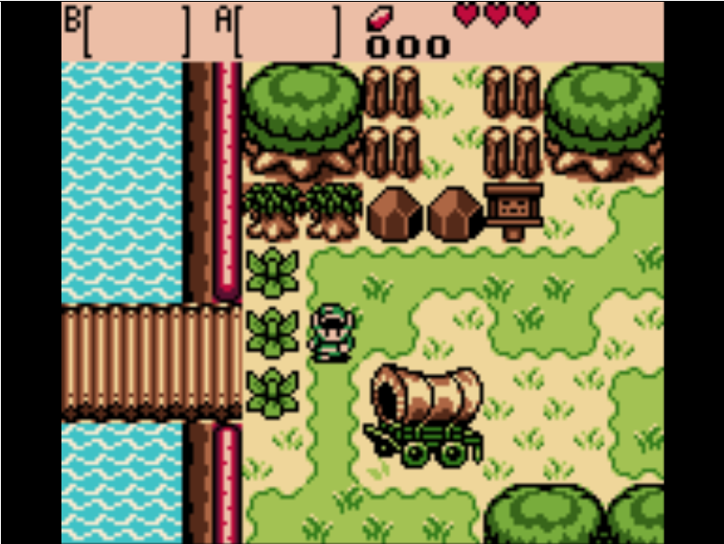

# Emscripten js-gameboy Games

Play old GameBoy games on your browser

# Prerequires

1. Python

# Run

Clone

```
git clone https://github.com/humbertodias/emscripten-js-gameboy-games.git
```

Into 

```
cd emscripten-js-gameboy-games/
```

Server

```
python -m SimpleHTTPServer 9090
```

Open on your browser

```
open http://localhost:9090
```

Select your rom


1. Press **X** on **Load Game**

2. Later **X** on **/**

3. Finally **X** on **Legend of Zelda, The - Oracle of Seasons (USA).zip**


# Output




# Tested Browsers

Browser | Performance |
------------- | -------------
Firefox | Fast
Chrome | Fast
Safari | Slow
Opera | Normal
IE | Didn't try


# References

1. RetroArch

	[http://toadking.com/retroarch/gambatte.html](http://toadking.com/retroarch/gambatte.html)